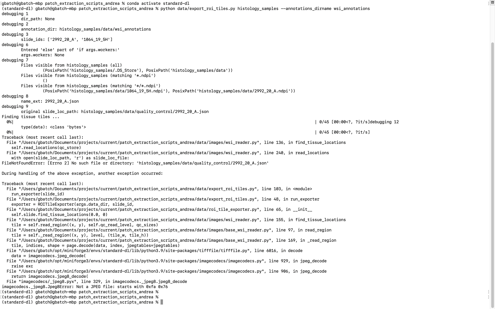

# Using this code for extraction of ROI tiles from .ndpi images

1. `cd /Users/gbatch/Documents/projects/current/DART-wo-data/tile-generation-scripts-andrea`
2. `conda activate standard-dl`
3. `python data/export_roi_tiles.py histology_samples --annotations_dirname wsi_annotations`

## Problem



Explanation

1. in `roi_tile_exporter.py` we have the following code
```python
self.slide = WSIReader(self.slide_path, {
        'patch_size': tile_size,
        'mpp': mpp,
        'data_dir': str(data_dir)
    }, set_mpp=set_mpp)
  self.slide.opt.patch_size = self.tile_size
  self.slide.find_tissue_locations(0.0, 0)
```

and the error comes from calling
```python
self.slide.find_tissue_locations(0.0, 0)
```

2. this is traced back to
```python
tile = self.read_region((x, y), self.qc_read_level, qc_sizes)
```
inside `WSIReader(TiffBaseReader)` class in `wsi_reader.py`

Using this `WSIReader` is wrong since `WSIReader` we need needs to inherit from the `OpenSlideReaderBase` instead of `TiffBaseReader` to read a .ndpi image.

3. Following error traceback we get en error coming from

```python
tile = self._read_region((x, y), level, (tile_w, tile_h))
```
inside `read_region` method of `TiffBaseReader`

4. This error traces back to internal functions in `tifffile` and `imagecodecs` python libraries because the image we are trying to read is not a .jpeg image, but a .ndpi image (see (2)).


## Solution

* Use a `WSIReader` inheriting from `OpenSlideReaderBase` instead of `TiffBaseReader`
* Stefano's code for it should be available in `/well/rittscher/users/ung356/src/pathology/common/`

**Note** need to rewrite the `WSIReader` or find one I can directly use Stefano's code.
